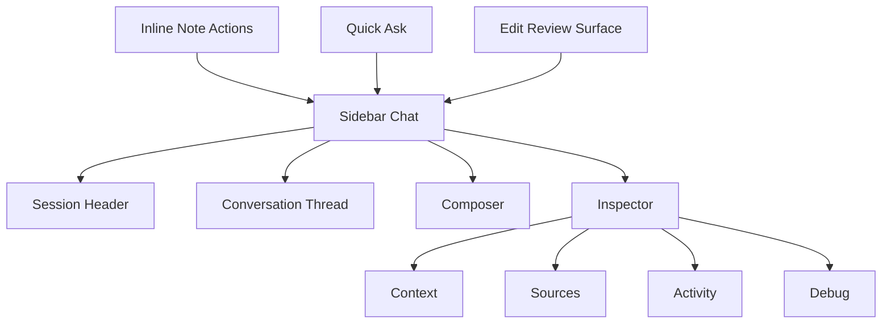
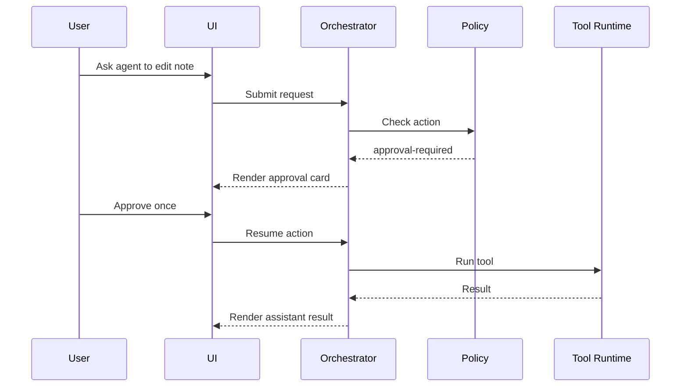

# DESIGN

## Purpose

This document defines the intended UI/UX, information architecture, component model, and interaction design for the plugin.

Use this document to answer:

- what the user should see first
- what should stay hidden until needed
- how chat, context, sources, activity, and approvals should relate
- how the assistant should feel inside Obsidian

This document complements:

- `spec/SPEC.md` for functional product behavior
- `spec/ARCHITECTURE.md` for system responsibilities and boundaries
- `spec/INTELLIGENCE.md` for product and market lessons from adjacent tools

## Design Goals

The product should feel:

- Obsidian-native
- calm, not noisy
- assistant-first, not debug-first
- local-first and trustworthy
- inspectable without overwhelming the main workflow
- safe around note edits and destructive actions

## Design Principles

### 1. Chat First

The main surface should be the conversation and composer.

The user should not need to scan provider paths, roots, raw context dumps, or retrieval debug details to ask a question.

### 2. Progressive Disclosure

Everything important should be available, but not everything should be visible at once.

Primary UI:

- session header
- conversation thread
- composer
- active context chips

Secondary UI:

- context inspection
- sources inspection
- activity inspection
- retrieval details
- raw debug data

### 3. Context Is Attachments, Not Clutter

Context should feel like something the user adds and the system resolves, not like a constantly expanded data dump.

Examples:

- current note
- selection
- `@note`
- `/command`
- retrieval-backed sources

### 4. Actions Must Feel Safe

The user should always understand whether the assistant is:

- reading
- retrieving
- generating
- proposing
- waiting for approval
- blocked by policy
- applying actions

Destructive actions must never feel ambiguous.

### 5. Obsidian Over IDE

We should learn from copilots, but not blindly copy IDE assumptions.

This is a notes product, not a code IDE with a note skin.

The UI should privilege:

- note context
- writing flow
- links and references
- vault-native persistence

over:

- terminal-heavy affordances
- code-review chrome everywhere
- raw internal diagnostics in the primary surface

## Lessons From Similar Products

### VS Code Copilot Chat

What to copy:

- separate surfaces for chat, inline work, context, and debug
- compact session configuration
- clear permission levels
- context is added intentionally, not always fully visible

What not to copy directly:

- IDE-heavy assumptions
- complex multi-pane coding workflows in the default sidebar

### OpenChamber / OpenCode Desktop GUI

What to copy:

- strong separation between main chat and secondary activity surfaces
- visible but contained tool activity
- rich workflows without overloading the main thread

What not to copy directly:

- heavy Git and terminal-centric structure in the default note assistant experience

### Smart Connections

What to copy:

- Obsidian-native retrieval UX
- semantic relevance as a note workflow
- local-first positioning
- result inspection through notes and snippets, not opaque ranking internals

What not to copy directly:

- treating retrieval as the entire assistant experience

### Text Generator

What to copy:

- reusable prompt workflows and templates
- flexible command/template model

What not to copy directly:

- overexposing prompt mechanics in the main UI

### Cursor / Continue / Cline / Windsurf

What to copy:

- dominant composer and thread
- compact, high-signal controls
- visible action states and permission gating

What not to copy directly:

- coding-agent metaphors that make sense only in IDEs

## Surface Model

The product should eventually have these surfaces:

### 1. Sidebar Chat

Primary everyday surface.

Responsibilities:

- ongoing conversation
- compact session configuration
- composing prompts
- attaching note context
- seeing answer sources
- seeing action/approval state

### 2. Inline Note Actions

Contextual entry points from a note or selection.

Examples:

- ask about selection
- edit selection
- summarize note
- run command on note

### 3. Quick Ask

Lightweight prompt surface for quick questions without opening the full sidebar.

### 4. Inspector

Secondary, collapsible, or tabbed surface for:

- context details
- sources details
- retrieval inspection
- tool activity
- approval/debug state

### 5. Edit Review Surface

Dedicated review/apply UI for changes, diffs, and approvals.

This should not be overloaded into the main chat timeline.

## Sidebar Information Architecture

### Primary Layout

```text
+--------------------------------------------------+
| Vault AI                                         |
| [Ask v]  [Model v]  [Context v]       [Status]   |
+--------------------------------------------------+
| Active context: [[Current Note]] @Research.md    |
| Sources: 3 notes                                 |
+--------------------------------------------------+
| Conversation                                     |
|                                                  |
| User                                              |
| can you find me 2 analytical database notes?     |
|                                                  |
| Assistant                                        |
| I found two strong candidates...                 |
| [Sources] [Activity] [Approve]                   |
|                                                  |
+--------------------------------------------------+
| / command...  @ note or agent...                 |
| Ask about the current note...                    |
|                                                  |
| [Send]                              [Add Context]|
+--------------------------------------------------+
```

### Secondary Layout

```text
+---------------- Inspector ----------------+
| Tabs: [Context] [Sources] [Activity]      |
|                                           |
| Retrieved Notes                           |
| - Notes/OLAP.md         score 19          |
|   "Columnar systems optimize..."         |
| - Notes/Warehouse.md    score 15          |
|   "Analytical queries often..."          |
|                                           |
| Tool Activity                             |
| - read-note allowed                       |
| - update-note approval-required           |
+-------------------------------------------+
```

## Sidebar Layout Rules

### Session Header

Keep this compact.

Visible by default:

- selected agent
- selected model
- context mode
- session state indicator

Not visible by default:

- root folders
- provider paths
- raw provider capability metadata
- long conversation path strings

### Active Context Row

Show only compact chips/summaries such as:

- current note chip
- explicit `@note` chip
- source count
- approval pending badge

This row should summarize context, not explain every detail.

### Conversation Thread

The thread should dominate the sidebar height.

Each assistant message may optionally expose:

- sources
- tool activity
- approval actions

But those details should be collapsed or secondary by default.

### Composer

The composer should support:

- `/` command autocomplete
- `@` mention autocomplete
- note/agent disambiguation through suggestions
- keyboard-first flow

The composer should feel like the center of the UI.

## Interaction Model

### Commands

`/` invokes a vault-defined command.

Commands should feel like reusable prompt actions, not like tool invocations.

### Mentions

`@` is shared mention syntax.

Rules:

- exact leading `@agent` can switch the agent for the turn
- other mentions should resolve to notes/files
- ambiguity must be surfaced clearly

### Skills

Skills should remain agent-internal by default.

The user should not need to choose a skill explicitly during common workflows.

### Tools

Tools are not a primary user-facing syntax.

They should appear as activity and approval events, not as commands the user types.

## Conversation UX

### Message Model

Each assistant message may contain:

- answer text
- citations
- tool activity
- approval controls
- error or blocked-state messaging

### Message Hierarchy

The assistant answer text should always be the most visually prominent part of a message.

Secondary elements in descending priority:

- sources
- approvals
- tool activity
- raw diagnostics

### Error UX

Raw provider errors should not be shown directly in the main chat body unless there is no clearer message available.

Instead, map them into user-facing product states such as:

- provider not configured
- model unavailable
- request timed out
- permission blocked
- approval required

The raw error can still live in Inspector/Debug.

### Empty States

Important empty states:

- no active note
- no provider configured
- no model available for provider
- empty conversation
- no retrieval results

These states should be friendly and instructional.

## Context UX

### Context Layers

The user-facing mental model should be:

1. selected scope
2. explicit mentions
3. retrieved support

### What To Show By Default

Show only:

- active scope
- explicit attached notes
- source count

### What To Hide Behind Inspector

- prompt context preview
- retrieved note snippets
- retrieval scores
- raw assembled context

## Sources UX

Sources should be a first-class concept, but compact.

Default behavior:

- show `Sources` affordance when present
- assistant text may include a small `Sources:` footer

Inspector behavior:

- note path
- why it was included
- snippet preview
- retrieval score when relevant

## Activity UX

Activity should be visible, but not dominant.

Activity types:

- reading context
- retrieving notes
- tool call requested
- tool call allowed
- tool call denied
- approval required
- changes proposed
- changes applied

Activity is better represented chronologically and compactly.

## Approval UX

Approval should feel explicit and safe.

### Approval States

- pending approval
- approved once
- denied
- temporarily approved for similar actions where allowed

### Approval Actions

- approve once
- deny
- approve next similar action
- approve remaining allowed actions in current run or conversation

### Always Explicit

These always require explicit approval:

- delete note
- move note
- destructive multi-note changes

### Approval Wireframe

```text
+----------------------------------------------+
| Approval needed                              |
| Agent wants to update note: Notes/Plan.md    |
|                                              |
| [Approve once] [Deny] [Approve similar next] |
+----------------------------------------------+
```

## Visual Language

### Tone

The design should feel:

- focused
- editorial
- technical but calm
- trustworthy

### Density

The current UI is too dense in the wrong places and too sparse in the wrong places.

Desired density:

- dense thread
- compact header
- minimal but useful composer controls
- diagnostics off the main path

### Typography

Use strong hierarchy:

- message author and answer body first
- labels and chips second
- muted metadata last

### Status Colors

Use color sparingly and semantically:

- neutral for standard state
- blue or purple for active assistant state
- yellow for approval needed
- red for blocked/error
- green only for explicit success/apply events

## Component Architecture

Target component tree:

```text
ChatShell
|- SessionHeader
|- ContextSummaryRow
|- ConversationThread
|  |- MessageCard
|     |- MessageBody
|     |- SourcesInline
|     |- ToolActivityInline
|     |- ApprovalCard
|- Composer
|  |- SuggestionMenu
|- InspectorDrawer
   |- ContextPanel
   |- SourcesPanel
   |- ActivityPanel
   |- DebugPanel
```

## State Architecture

Target state groups:

- `ChatSessionState`
- `SessionConfigState`
- `ComposerState`
- `ResolvedContextState`
- `ActivityState`
- `ApprovalState`
- `InspectorState`

### Principle

Do not let one large component own everything.

The current monolithic shell should be broken into these state boundaries so UI redesign does not require unrelated runtime changes.

## Mermaid Diagrams

### Surface Model



### Approval Flow



## Anti-Patterns

Avoid:

- showing root folders and internal config paths in the main session header
- large debug blocks in the default chat flow
- always-visible prompt context preview
- mixing configuration with every conversation turn
- exposing raw provider errors as the default UX
- letting thread height collapse because of inspector content

## Phased Redesign Plan

### Phase 1: Simplify the Shell

- reduce header chrome
- remove debug-heavy pills from the primary surface
- make the thread taller and more readable
- make the composer visually dominant

### Phase 2: Introduce Inspector Separation

- move resolved context details into `Context`
- move retrieved-note details into `Sources`
- move tool activity and approval logs into `Activity`
- reserve `Debug` for raw internals

### Phase 3: Rebuild Conversation UI

- cleaner message cards
- cleaner error states
- compact source rendering
- activity/approval cards instead of raw blocks

### Phase 4: Add Edit and Approval Surfaces

- dedicated approval cards
- edit preview surface
- diff review flow

## Current Assessment

The current implementation has strong runtime foundations but the sidebar mixes:

- product UX
- system diagnostics
- session configuration
- inspection details

The redesign should correct that before more major feature growth.
